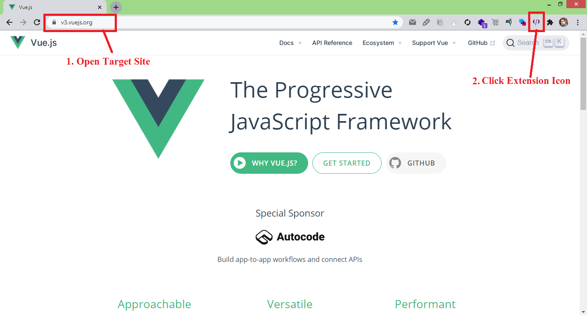
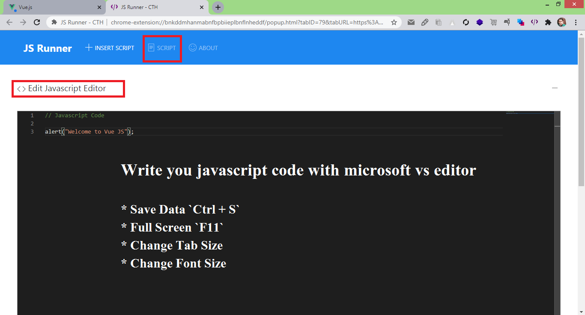
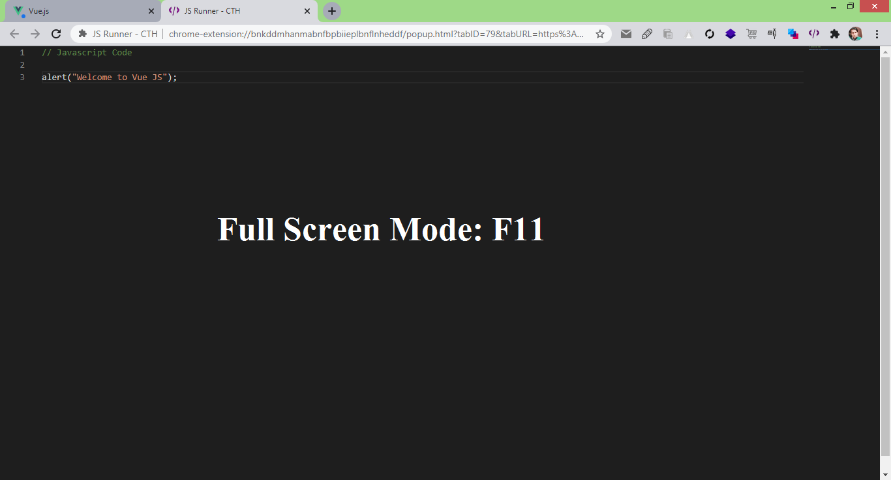
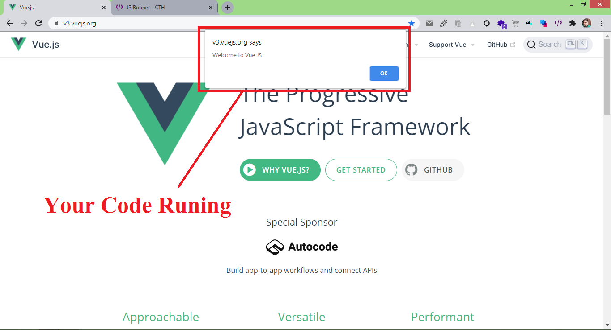

# JS Runner - CTH

Run JavaScript Code in the Chrome Tab Site (Online Sites)

## ✨ Features

* Run Custom JavaScript in Sites
* Microsoft VS Editor

### Editor Shortcut Key 

* Save Data `Ctrl + S`
* Full Screen `F11`
* Change Tab Size
* Change Font Size

## 📦 [Install Extension]()

## Screenshot

## Browser Support

- `Chrome (Latest)`

##  Libraries

* [Monaco Editor Webpack Loader Plugin](https://github.com/microsoft/monaco-editor-webpack-plugin)
  * `npm install monaco-editor`
  * `npm install monaco-editor-webpack-plugin`
* UIkit: https://getuikit.com/

## 🚀 Debugging

* `npm run watch`
* `npm run build`
* `npm run build-zip`

## Changelog

### `Processing`

* Run script on page site when reload site 

### V.0.0.1

* Monaco Editor
* All script saved page
* About us page

## Reporting Issues radioactive

If you have a problem with this plugin or found any bug, please open an issue on GitHub.

## 📝 Copyright and License copyright

Code copyright 2020 ctechhindi. Code released under the MIT license.